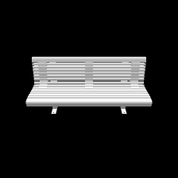
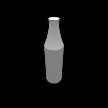
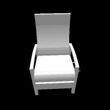
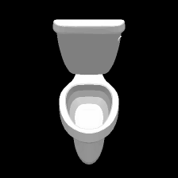

  
<br><br><br><br>

# Semantic Robustness of Deep Neural Networks
### [Paper](https://arxiv.org/pdf/1904.04621.pdf) | [Tutorial](https://colab.research.google.com/drive/1cZzTPu1uwftnRLqtIIjjqw-YZSKh4QYn)<br>
Pytorch implementation of the paper on Arxive. The paper tries to address the robustness of Deep Neeural Networks, but not from pixel-level perturbation lense , rather from semantic lense in which the perturbation happens in the lkatent parameters that genberate the image. this typer of robustness for safety-critical applications like self-driving cars in which tolerance of error is very low and risk of failure is high. <br><br>
[Towards Analyzing Semantic Robustness of Deep Neural Networks](https://arxiv.org/pdf/1904.04621.pdf)  
 [Abdullah Hamdi](http://www.fihm.ai), [Bernard Ghanem](http://www.bernardghanem.com/)

## Examples of Results
- ### visualizing the Deep networks average semantic profiles for 10 objects.


- ### visualizing the Deep networks semantic profiles for average  objects.


- ### visualizing the Deep networks semantic profiles for average  objects.


## Prerequisites
- Linux 
- Python 2 or 3
- NVIDIA GPU (11G memory or larger) + CUDA cuDNN

## Getting Started
### Installation
- install [anaconda](https://docs.anaconda.com/anaconda/install/) and then run the following commans 
```bash
conda env create -f environment.yaml
source activate semantic
conda install -c anaconda cudatoolkit==9.0
pip install git+https://github.com/daniilidis-group/neural_renderer
```
- Clone this repo:
```bash
git clone https://github.com/ajhamdi/semantic-robustness
cd semantic-robustness
```


### Simple Tutorial:
- We provide a simple tutorial 
Please download the pre-trained Cityscapes model from [here](https://drive.google.com/file/d/1h9SykUnuZul7J3Nbms2QGH1wa85nbN2-/view?usp=sharing) (google drive link), and put it under `./checkpoints/label2city_1024p/`
- Test the model (`bash ./scripts/test_1024p.sh`):
```bash
#!./scripts/test_1024p.sh
python test.py --name label2city_1024p --netG local --ngf 32 --resize_or_crop none
```
The test results will be saved to a html file here: `./results/label2city_1024p/test_latest/index.html`.

More example scripts can be found in the `scripts` directory.


### Dataset
- We collect 100 3D shapes from 10 classes from [ShapeNet](https://www.shapenet.org/) that are also exist in [ImagNet](http://www.image-net.org/) and made sure that networks trained on ImageNEt identifies these shapes of ShapeNet nefore proceeding. All the obj files are availabe in the `sacale` directory which contain the dataset. The following are visuailzations of the 3D dataset used in our paper.

                 

### Testing with your own 3D dataset and networks
- `TODO NEXT`

## Citation

If you find this useful for your research, please use the following.

```
@article{hamdi2019towards,
  title={Towards Analyzing Semantic Robustness of Deep Neural Networks},
  author={Hamdi, Abdullah and Ghanem, Bernard},
  journal={arXiv preprint arXiv:1904.04621},
  year={2019}
}
```

## Acknowledgments
This work is suuported by King Abdullah University of Science and Technology (KAUST).The code borrows heavily from [neural mesh renderer](https://github.com/daniilidis-group/neural_renderer).
