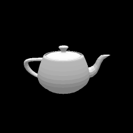
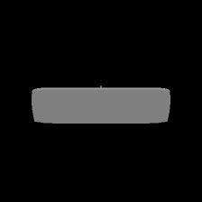
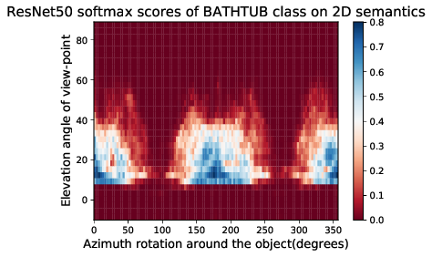
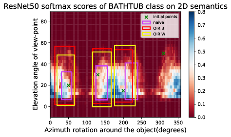

  
<br><br><br><br>

# Towards Analyzing Semantic Robustness of Deep Neural Networks (ECCV 2020)
### [Paper](https://arxiv.org/pdf/1904.04621.pdf) | [Video](https://youtu.be/rf5ynrBap2Q) | [Tutorial](https://colab.research.google.com/drive/1cZzTPu1uwftnRLqtIIjjqw-YZSKh4QYn). <br>
Pytorch implementation of the paper in [ECCV'20 Workshop on Adversarial Robustness in the Real World](https://eccv20-adv-workshop.github.io/). The paper tries to address the robustness of Deep Neeural Networks, but not from pixel-level perturbation lense, rather from semantic lense in which the perturbation happens in the latent parameters that generate the image. This type of robustness is important for safety-critical applications like self-driving cars in which tolerance of error is very low and risk of failure is high. <br><br>
[Towards Analyzing Semantic Robustness of Deep Neural Networks](https://arxiv.org/pdf/1904.04621.pdf)  
 [Abdullah Hamdi](http://www.abdullahamdi.com), [Bernard Ghanem](http://www.bernardghanem.com/)

## Citation

If you find this useful for your research, please use the following.

```
@article{hamdi2019towards,
  title={Towards Analyzing Semantic Robustness of Deep Neural Networks},
  author={Hamdi, Abdullah and Ghanem, Bernard},
  journal={arXiv preprint arXiv:1904.04621},
  year={2019}
}
```

## Examples of Results

- ### visualizing the Deep networks semantic profiles (2D) for 100 objects from 10 classes.
<p float="left">
          

</p>

- ### Detecting robust regions of the networks with bounds-optimzing algorithms (2D).


### Dataset
- We collect 100 3D shapes from 10 classes from [ShapeNet](https://arxiv.org/abs/1512.03012). The details are found [here](https://github.com/ajhamdi/semantic-robustness/tree/master/scale)

## Prerequisites
- Linux 
- Python 2 or 3
- NVIDIA GPU (11G memory or larger) + CUDA cuDNN

## Getting Started
### Installation
- install [anaconda](https://docs.anaconda.com/anaconda/install/) and then run the following commans 
```bash
conda env create -f environment.yaml
source activate semantic
conda install -c anaconda cudatoolkit==9.0
pip install git+https://github.com/daniilidis-group/neural_renderer
```
- Clone this repo:
```bash
git clone https://github.com/ajhamdi/semantic-robustness
cd semantic-robustness
```


### Simple Colab Tutorial with a toy example:
We provide a simple tutorial on a Colab notebook [here](https://colab.research.google.com/drive/1cZzTPu1uwftnRLqtIIjjqw-YZSKh4QYn) and on Jupyter notebook [here](https://github.com/ajhamdi/semantic-robustness/blob/master/toturial/semantic_robustness_toturial.ipynb) to test a toy example on some 3D objects and apply the bound optimzation algorithms for sample points in the 1D case directly on the cloud. The complete results obtained in the `results` directory are obtained as of the following sections  

<br>

### Running the experiments

1. #### Mapping the deep networks fully
you have to run `map.py` like the following:
```python
python map.py --network resnet --gpu 0 --class_nb 1 --object_nb 0 --override
```

1. #### Finding the robust regions of the networks by the optimization
you have to run `optim.py` like the following:
```python
python optim.py --network resnet --gpu 0 --class_nb 1 --object_nb 0 --override
```
The arguments descriptions are as follows:

- **network** : trained network type used in the experiments, choices=('incept', 'alexnet', 'vgg',"resnet") corresponding to (InceptionV3, ResNet50, VGG, AlexNet)
- **gpu** : the GPU number in which the exp perfoprmed 
- **class_nb** : number of the class used for the experiment (0-9) of the [dataset](https://github.com/ajhamdi/semantic-robustness/tree/master/scale)
- **object_nb** : number of the 3D object used for the experiment (0-9) of the [dataset](https://github.com/ajhamdi/semantic-robustness/tree/master/scale)
- **override** : a flag to override exisisting results


#### saving the results:
The `checkpoint` directory contains the results as dictionaries and is arranged as follws :
 ```
 ├── ...
    ├── checkpont                    # contaong the optimzatations traces of all experiments 
    │   ├── NETWORK_NAME           # the network
    │   |    ├── CLASS_NUMBER           # class number (0-9) whcih is part of the 10 3D classes above and also part of ImageNet Classes 
                 ├── OBJECT_NUMBER    #number of the object (0-9) from the 10 objects in that specific class 
    │   └── ...               
    └── ...
```
The results from `optim.py` will be saved as dictionaries to the directory : `./checkpoint/NETWORK_NAME/CLASS_NUMBER/OBJECT_NUMBER/optim.pt`. and the mapping results from `map.py` will be wsaved in `./checkpoint/NETWORK_NAME/CLASS_NUMBER/OBJECT_NUMBER/map.pt` 

The `map.pt` dictionary contains the following:
```python
map_dict = torch.load("checkpoint/ResNet50/0/0/map.pt")
map_dict
{
"xx": # azimuth parameters list  
"yy" : # elevation parameters list
"z" : # the network confidence 
}

```

The `optim.pt` dictionary contains the optimization results as follows:
```python
optim_dict = torch.load("checkpoint/ResNet50/0/0/optim.pt")
optim_dict
{
"initial_point": # the initial point used in the optimization 
"network_name" : # the network name used in the evaluation ["ResNet50" , "Inceptionv3", "VGG", "AlexNet"]
"class_nb" : # the class nb [0-9] used in the experiments
"OIR_W" OR "OIR_B" OR "naive" = #  the type of optimization method used 
   {"optim_trace" : # the trace of the bounds through the the optimization (list of traces for every initial point)
    "loss_trace" : #the trace of the loss throug the optimization (list of traces for every initial point)
    "regions": #last region converged to (list of ndintervall class  for every initial point) 
   }
}

```


### Testing with your own 3D dataset and networks
- *TODO NEXT*


## Acknowledgments
This work is suuported by King Abdullah University of Science and Technology (KAUST).The code borrows heavily from [neural mesh renderer](https://github.com/daniilidis-group/neural_renderer).
