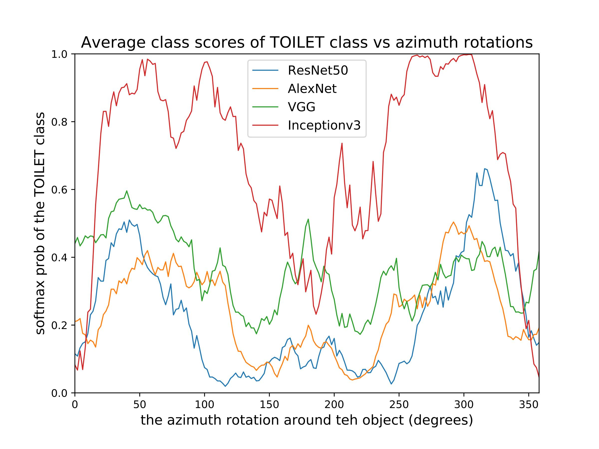

  
<br><br><br><br>

# Towards Analyzing Semantic Robustness of Deep Neural Networks (ECCV 2020)
### [Paper](https://arxiv.org/pdf/1904.04621.pdf) | [Video](https://youtu.be/rf5ynrBap2Q) | [Tutorial](https://colab.research.google.com/drive/1cZzTPu1uwftnRLqtIIjjqw-YZSKh4QYn). <br>
Pytorch implementation of the paper in [ECCV'20 Workshop: Adversarial Robustness in the Real World](https://eccv20-adv-workshop.github.io/). The paper tries to address the robustness of Deep Neeural Networks, but not from pixel-level perturbation lense, rather from semantic lense in which the perturbation happens in the latent parameters that generate the image. This typer of robustness for safety-critical applications like self-driving cars in which tolerance of error is very low and risk of failure is high. <br><br>
[Towards Analyzing Semantic Robustness of Deep Neural Networks](https://arxiv.org/pdf/1904.04621.pdf)  
 [Abdullah Hamdi](http://www.abdullahamdi.com), [Bernard Ghanem](http://www.bernardghanem.com/)

## Citation

If you find this useful for your research, please use the following.

```
@article{hamdi2019towards,
  title={Towards Analyzing Semantic Robustness of Deep Neural Networks},
  author={Hamdi, Abdullah and Ghanem, Bernard},
  journal={arXiv preprint arXiv:1904.04621},
  year={2019}
}
```

## Examples of Results
- ### visualizing the Deep networks average semantic profiles (1D) for 10 objects for 10 classes.


- ### Detecting robust regions of the networks with bounds-optimzing algorithms (1D).
<p float="left">
 
</p>

- ### visualizing the Deep networks semantic profiles (2D) for 100 objects from 10 classes.
<p float="left">
          

</p>

- ### Detecting robust regions of the networks with bounds-optimzing algorithms (2D).


## Prerequisites
- Linux 
- Python 2 or 3
- NVIDIA GPU (11G memory or larger) + CUDA cuDNN

## Getting Started
### Installation
- install [anaconda](https://docs.anaconda.com/anaconda/install/) and then run the following commans 
```bash
conda env create -f environment.yaml
source activate semantic
conda install -c anaconda cudatoolkit==9.0
pip install git+https://github.com/daniilidis-group/neural_renderer
```
- Clone this repo:
```bash
git clone https://github.com/ajhamdi/semantic-robustness
cd semantic-robustness
```


### Simple Colab Tutorial with a toy example:
We provide a simple tutorial on colab [here](https://colab.research.google.com/drive/1cZzTPu1uwftnRLqtIIjjqw-YZSKh4QYn) to test a toy example on some 3D objects and apply the bound optimzation algorithms for sample points in the 1D case directly on the cloud. The complete results obtained in the `results` directory are obtained as of the following sections  


### Dataset
- We collect 100 3D shapes from 10 classes from [ShapeNet](https://www.shapenet.org/) that are also exist in [ImagNet](http://www.image-net.org/) and made sure that networks trained on ImageNEt identifies these shapes of ShapeNet nefore proceeding. All the obj files are availabe in the `sacale` directory which contain the dataset. The classes are the following 
1. **aeroplane** : with ImageNet class label 404
1. **bathtub** : with ImageNet class label 435
1. **bench** : with ImageNet class label 703
1. **bottle** : with ImageNet class label 898
1. **chair** : with ImageNet class label 559
1. **cup** : with ImageNet class label 968
1. **piano** : with ImageNet class label 579
1. **rifle** : with ImageNet class label 413
1. **vase** : with ImageNet class label 883
1. **toilet** : with ImageNet class label 861
#### visualization:
                 

<br>

### Running the full experiments

1. #### Mapping the deep networks fully
you have to run `map.py` with the following options 


1. #### Finding the robust regions of the networks 
you have to run `test.py` with the following options 


#### saving the results:
The `checkpoint` directory contains the results as dictionaries and is arranged as follws :
 ```
 ├── ...
    ├── checkpont                    # contaong the optimzatations traces of all experiments 
    │   ├── NETWORK_NAME           # the network
    │   |    ├── CLASS_NUMBER           # class number (0-9) whcih is part of the 10 3D classes above and also part of ImageNet Classes 
                 ├── OBJECT_NUMBER    #number of the object (0-9) from the 10 objects in that specific class 
    │   └── ...               
    └── ...
```
The optimization test results from `test.py` will be saved as dictionaries to the directory : `./results/NETWORK_NAME/CLASS_NUMBER/OBJECT_NUMBER/optim.pt`. and the mapping results from `map.py` will be wsaved in `./results/NETWORK_NAME/CLASS_NUMBER/OBJECT_NUMBER/map.pt`   where:
- NETWORK_NAME is the name of the network being analyzed 
- CLASS_NUMBER is the class number (0-9) whcih is part of the 10 3D classes above and also part of ImageNet Classes  
- OBJECT_NUMBER is the number of the object (0-9) from the 10 objects in that specific class

The `map.pt` dictionary contains the following:

The `optim.pt` dictionary contains the following:


### Testing with your own 3D dataset and networks
- `TODO NEXT`


## Acknowledgments
This work is suuported by King Abdullah University of Science and Technology (KAUST).The code borrows heavily from [neural mesh renderer](https://github.com/daniilidis-group/neural_renderer).
