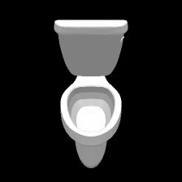

# Dataset
- We collect 100 3D shapes from 10 classes from [ShapeNet](https://www.shapenet.org/) that are also exist in [ImagNet](http://www.image-net.org/) and made sure that networks trained on ImageNEt identifies these shapes of ShapeNet nefore proceeding. All the obj files are availabe in the `sacale` directory which contain the dataset. The classes are the following 
1. **aeroplane** : with ImageNet class label 404
1. **bathtub** : with ImageNet class label 435
1. **bench** : with ImageNet class label 703
1. **bottle** : with ImageNet class label 898
1. **chair** : with ImageNet class label 559
1. **cup** : with ImageNet class label 968
1. **piano** : with ImageNet class label 579
1. **rifle** : with ImageNet class label 413
1. **vase** : with ImageNet class label 883
1. **toilet** : with ImageNet class label 861
## visualization:
                 
<br>
## mapping every object in the dataset:
the dictionary at `true_dict.py` cpntains the mappping that maps every **OBJET_NB** and **CLASS_NB** used in the code to a specific 3D object ID in shape Net. The dictionary is ordered as the following :

```python
TRUE_DICT =
{
'cass_nb' : 
     {
      `object_nb`: `object_ID`
      }
}
```
